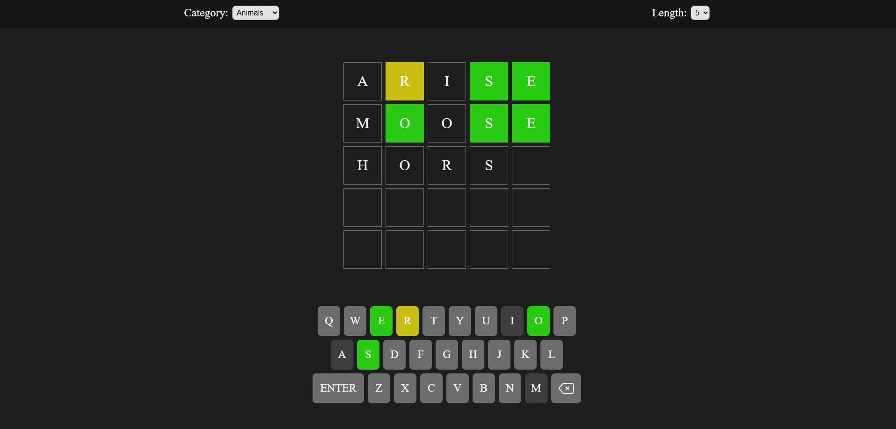

# React Wordle
A customizable Wordle-inspired game built with React, featuring category selection, variable word lengths, and real-time word validation using external APIs.

🔗 Live Demo  
[Play the game](https://vivi4na02l.github.io/Wordle-React/)

## Preview

## Features
- Multiple word categories:
  - Animals
  - Countries
  - Sports

- Adjustable word length:
  - 4 letters
  - 5 letters
  - 6 letters

- Real-time validation for user input
- Visual feedback system inspired by the original Wordle
- Dynamic word generation using external APIs
- Responsive interface

## Default Configuration
When opening the game, the default settings are:
- Category: Animals
- Word length: 5 letters

## APIs Used

### Random Word API
Used to generate random words based on selected category and word length.

https://random-words-api.kushcreates.com/

### Dictionary API
Used to validate whether typed words exist.

https://dictionaryapi.dev/

### REST Countries API
Used specifically to validate country names, since the dictionary API does not recognize many countries.

https://restcountries.com/

## Tech Stack

- React
- JavaScript (ES6+)
- CSS3
- REST APIs

## What I Focused On

- State management in React
- Dynamic API integration
- Conditional rendering
- Input validation logic
- Handling multiple validation sources
- Creating a customizable gameplay experience

## Project Context

This project was developed to further explore React fundamentals, component-based architecture, and API integration while recreating and extending the mechanics of the classic Wordle game.
